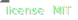

# derek

 

Tools for converting data into schema.

(Still very much pre-alpha!)

Implemented in multiple languages.

|                       | Index                                       | Coverage                                             | Supported versions                                          | Downloads                                            |
| --------------------- | ------------------------------------------- | ---------------------------------------------------- | ----------------------------------------------------------- | ---------------------------------------------------- |
| Python                |  |  |  | -                                                    |
| JavaScript (node.js)  |    |  |        |  |
| Rust _(coming soon!)_ | -                                           | -                                                    | -                                                           | -                                                    |
| Nim _(coming soon!)_  | -                                           | -                                                    | -                                                           | -                                                    |

1. [Installation](#installation)
2. [What is Derek?](#what-is-derek-)
   1. [Document data structures](#derek-documents-data-structures-)
   2. [Extract schemas from APIs](#derek-extracts-schemas-from-apis)
   3. [Really lightweight](#derek-is-really-lightweight)
   4. [Extensible](#derek-is-extensible)
   5. [KISS](#derek-is-straightforward-)
3. [Documentation](docs/index.md)
   1. [Features](docs/features.md)
   2. [Specification](docs/spec.md)
   3. [API](docs/spec.md)

## Installation

### Python

You can install this from the `pypi` index. It's available as the `derek-py` package.

Simple example with `pip` (`poetry` is recommended):

```python
pip install derek-py
```

Complete set of supported installation methods:

| Package manager | pypi                   | git                                                           |
| --------------- | ---------------------- | ------------------------------------------------------------- |
| pip             | `pip install derek-py` | `pip install git+https://github.com/benjaminwoods/derek@main` |
| poetry          | `poetry add derek-py`  | `poetry add git+https://github.com/benjaminwoods/derek#main`  |

### Javascript (Node.js)

You can install this from the `npm` index. It's available as the `derek-js` package.

Simple example with `yarn`:

```python
yarn add derek-js
```

Complete set of supported installation methods:

| Package manager | npm                 | git                                                        |
| --------------- | ------------------- | ---------------------------------------------------------- |
| npm             | `npm i derek-js`    | `npm i git+https://github.com/benjaminwoods/derek#main`    |
| yarn            | `yarn add derek-js` | `yarn add git+https://github.com/benjaminwoods/derek#main` |

## What is Derek? <a name="what"></a>

Here's a quick guide showing what you can do with `derek`. These examples are
for a Python implementation.

### Derek documents data structures. <a name="data"></a>

Load some data into a tree of nodes:

```python
# Import the main class
from derek import Derek

# Suppose that you have some JSON-compatible data
obj = [
  {
    'some': [1.0, 3, "4.5"],
    'data': [3.4, 4.5]
  },
  {
    'some': [2, "4.0", 1.5],
    'data': [1.4]
  }
]

# Feed this data into Derek.tree
root_node = Derek.tree(obj, name='MyDataStructure')
```

You can use `.example()` to see a simple example item of data:

```python
>>> root_node.example()
[{'some': [1.0], 'data': [3.4]}]
```

You can produce an OAS2/OAS3 JSON schema from this data, too:

```python
j = root_node.parse(format='oas3')
import json
print(json.dumps(j, indent=2))
```

```json
{
  "MyDataStructure": {
    "type": "array",
    "items": {
      "type": "object",
      "additionalProperties": {
        "oneOf": [
          {
            "type": "array",
            "items": {
              "oneOf": [
                {
                  "type": "string"
                },
                {
                  "type": "integer"
                },
                {
                  "type": "number"
                }
              ]
            }
          },
          {
            "type": "array",
            "items": {
              "type": "number"
            }
          }
        ]
      }
    },
    "example": [
      {
        "some": [1.0],
        "data": [3.4]
      }
    ]
  }
}
```

Install and use the [`yaml`](https://github.com/yaml/pyyaml) package to
convert this structure to an OAS3-compliant data schema.

```python
import yaml
print(yaml.dump(j))
```

```yaml
MyDataStructure:
  example:
    - data:
        - 3.4
      some:
        - 1.0
  items:
    additionalProperties:
      oneOf:
        - items:
            type: number
          type: array
        - items:
            oneOf:
              - type: number
              - type: integer
              - type: string
          type: array
    type: object
  type: array
```

### Derek extracts schemas from APIs.

Quickly extract schemas from APIs, by feeding the returned JSON into Derek.

```python
from derek import Derek

from pycoingecko import CoinGeckoAPI
cg = CoinGeckoAPI()

# Get all coins from CoinGecko
root_node = Derek.tree(cg.get_coins_list(), name='GetCoins')
```

Parse to get your schema:

```python
j = root_node.parse(format='oas3')
import json
print(json.dumps(j, indent=2))
```

```json
{
  "GetCoins": {
    "type": "array",
    "items": {
      "type": "object",
      "additionalProperties": {
        "type": "string"
      }
    },
    "example": [
      {
        "id": "01coin",
        "symbol": "zoc",
        "name": "01coin"
      }
    ]
  }
}
```

### Derek is really lightweight.

**No required dependencies. Always.**

### Derek is extensible.

Use libraries like [`pywhat`](https://github.com/bee-san/pyWhat) and
[`yaml`](https://github.com/yaml/pyyaml) to quickly extend `Derek`:

```python
import json, yaml

from derek import Derek, Parser

from pywhat import Identifier

class PywhatDerek(Derek):
    @property
    def parser(self):
        return PywhatParser()

    def get_oas3_yaml(self):
        return yaml.dump(
            self.parse(format="oas3")
        )

class PywhatParser(Parser):
    @classmethod
    def oas2(cls, node):
        # Call the superclass parser for the current node:
        #   _sup = cls.__mro__[PywhatParser.__mro__.index(int):]
        #   j = _sup.oas2(cls, node)
        # All calls to the oas2 method in the superclass therefore re-route
        # back to this class method, automatically handling all recursive calls
        # here.
        j = super(PywhatParser, cls).oas2(node)

        # The rest of this function simply patches in results from a call
        # to the pywhat API.
        identifier = Identifier()

        if all(map(lambda t: not isinstance(node.value, t), [list, dict])):
            result = identifier.identify(str(node.value))

            if result['Regexes'] is not None:
                matches = [entry for entry in result['Regexes']['text']]

                # Select the match as the longest string
                map_func = lambda d: (d['Matched'], d['Regex Pattern']['Name'])
                max_func = lambda tup: len(tup[0])
                _, match = max(
                    map(map_func, matches),
                    key=max_func
                )

                j = {
                    **j,
                    'description': match
                }

        return j
```

Allowing for functionality like:

```python
root_node = PywhatDerek.tree(
    {'data': ['17VZNX1SN5NtKa8UQFxwQbFeFc3iqRYhem']},
    name='Addresses'
)
root_node.get_oas3_yaml()
```

returning:

```yaml
Addresses:
  additionalProperties:
    items:
      description: "Bitcoin (\u20BF) Wallet Address"
      type: string
    type: array
  example:
    data:
      - 17VZNX1SN5NtKa8UQFxwQbFeFc3iqRYhem
  type: object
```

## Derek is straightforward. <a name="kiss"></a>

Derek is designed for ease of use. If you're trying to use Derek functionality
in a workflow and it feels like it should be easier to get your desired result,
please make an issue.
